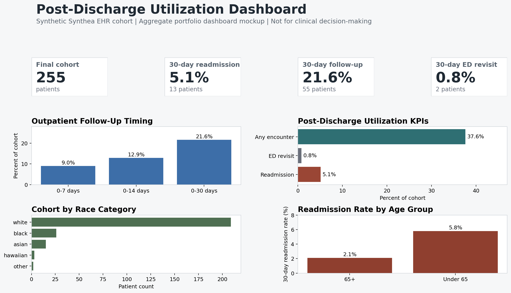

# Retrospective Post-Discharge Utilization Analytics Workflow

[Overview](#project-overview) | [Research Question](#research-question) | [Workflow Design](#healthcare-analytics-workflow-design) | [Analytics Focus](#core-analytics-focus) | [Analytic Scope](#analytic-scope) | [Technical Environment](#technical-environment) | [Dashboard and BI](#dashboard-and-bi-layer) | [Results](#results-overview) | [Stakeholder Use](#stakeholder-use-case) | [Skills](#skills-demonstrated) | [Workflow Status](#workflow-status) | [Repository Structure](#repository-structure) | [Data Setup](#data-setup) | [Outputs](#current-outputs) | [Responsible Use](#responsible-use)

## Project Overview

This project demonstrates an end-to-end retrospective healthcare utilization analytics workflow using Synthea synthetic EHR data. It simulates a health system analytics request to define an adult inpatient cohort, track core post-discharge utilization measures, identify outpatient follow-up timing, and evaluate factors associated with 30-day inpatient readmission.

The project is built for healthcare analytics, clinical research analytics, and health system research data analyst roles where reproducibility, data governance, SQL logic, and clear communication are essential.

## Research Question

Among adult patients with a first eligible acute inpatient hospitalization in Synthea synthetic EHR data, how are outpatient follow-up timing, demographic characteristics, clinical conditions, prior utilization, and discharge-related factors associated with all-cause inpatient readmission within 30 days of discharge?

## What This Project Demonstrates

This project demonstrates the practical workflow behind a retrospective EHR analytics request: profiling raw data extracts, validating encounter classifications, defining an eligible inpatient cohort, deriving post-discharge utilization measures, creating a 30-day readmission outcome, and preparing reproducible analysis-ready outputs.

## Healthcare Analytics Workflow Design

This project follows a validation-first analytics workflow common in healthcare operations, population health, and clinical research analytics. Raw synthetic EHR extracts are profiled before cohort construction so available tables, fields, encounter classes, date structures, and missingness patterns are understood before outcome derivation.

The workflow emphasizes validation of encounter classification, temporal sequencing, missingness, and operational edge cases before analysis. SQL and Python are used to support reproducible, auditable healthcare analytics workflows that can be reviewed by technical analysts, clinical stakeholders, and population health teams.

This project intentionally separates data profiling, cohort construction, outcome derivation, validation, statistical analysis, and reporting so each step can be reviewed and updated independently.

## Why This Project Matters

Health system research and population health teams need reproducible workflows for defining cohorts, deriving post-discharge outcomes, validating EHR data, assessing missingness, conducting statistical analysis, and preparing manuscript-ready outputs. This project is intended to demonstrate those skills in a public, privacy-preserving way using synthetic data.

## Core Analytics Focus

- Retrospective EHR analytics
- Inpatient cohort construction
- Post-discharge utilization tracking
- 30-day readmission derivation
- Temporal sequencing validation
- SQL and Python healthcare analytics workflows
- Data validation and QA workflows
- Healthcare analytics-oriented documentation

## Outcome and Utilization Measures

- 30-day inpatient readmission
- ED revisit within 30 days
- Outpatient follow-up within 7, 14, and 30 days
- Days to first outpatient follow-up
- Total post-discharge encounters within 30 days

## Analytic Scope

The project is framed around post-discharge utilization analytics rather than generic readmission prediction. The core workflow focuses on defining an adult inpatient cohort, validating encounter and date logic, deriving outpatient follow-up timing, identifying ED revisits, and measuring all-cause 30-day inpatient readmission.

The current version uses a focused MVP variable set: demographics, index hospitalization dates, length of stay, prior utilization, outpatient follow-up within 7, 14, and 30 days, ED revisit within 30 days when identifiable, and 30-day inpatient readmission. Additional variables such as disease subgroups, discharge disposition, payer, mortality, medication counts, and lab values are treated as exploratory only if the Synthea export supports defensible derivation.

Outpatient follow-up measures are interpreted as observational utilization measures. This project does not claim that outpatient follow-up causes a change in readmission risk.

## Technical Environment

- SQL
- Python / pandas
- Jupyter notebooks
- Synthea synthetic EHR data
- Power BI or Tableau
- GitHub workflow with feature branching and pull requests

## Dashboard and BI Layer

The project also incorporates a healthcare operations and population health dashboard layer intended to simulate stakeholder-facing KPI reporting and utilization analytics workflows commonly used in health systems.

The BI layer is designed around readmission KPIs, follow-up analytics, ED revisit reporting, cohort summaries, and operational healthcare metrics. It is intended to support clear communication of cohort trends and post-discharge utilization patterns without presenting the project as a clinical decision tool.



Dashboard-ready aggregate tables are available in `outputs/bi/` and can be imported into Power BI or Tableau:

- `cohort_summary_table.csv`
- `readmission_kpi_table.csv`
- `followup_timing_table.csv`
- `ed_revisit_table.csv`
- `demographic_utilization_summary_table.csv`

## Results Overview

The current workflow has completed data profiling, SQL cohort construction, validation QA, aggregate BI output generation, descriptive analysis, and exploratory modeling using local Synthea synthetic CSV data. These results are included to demonstrate reproducible healthcare analytics workflow design, not clinical performance or causal inference.

The final analytic dataset includes 255 adult patients with a first eligible inpatient encounter. Validation outputs confirmed one index encounter per patient, no missing primary readmission outcome, and no invalid index encounter start or stop dates in the final analytic dataset.

All-cause inpatient readmission within 30 days occurred for 13 patients, or 5.1% of the cohort. Outpatient follow-up was observed for 9.0% of patients within 7 days, 12.9% within 14 days, and 21.6% within 30 days. ED revisit within 30 days was uncommon in this synthetic cohort at 0.8%, while any post-discharge encounter within 30 days occurred for 37.6% of patients.

The most useful takeaway is operational: the workflow shows how a healthcare analyst can validate EHR-style encounter data, define post-discharge timing windows, produce aggregate utilization measures, and prepare a stakeholder-facing readout. The exploratory logistic regression included 255 observations and 13 readmission events and should be interpreted only as a demonstration of analytic workflow mechanics.

The full report is available in `report/final_report.md`.

## Stakeholder Use Case

A physician investigator, care transitions leader, quality improvement team, or population health analytics group could use this type of readout to move from raw encounter data toward operational questions about post-discharge care.

The current outputs would support discussion of outpatient follow-up access, high-utilization patients, encounter classification quality, timing-window validation, subgroup reporting, and whether the cohort definition matches the intended operational question. These outputs should be used to frame stakeholder review and next analytic questions, not to make clinical claims from synthetic data.

## Skills Demonstrated

- Healthcare analytics
- Population health analytics
- Healthcare operations analytics
- Retrospective clinical research
- Synthetic EHR data
- SQL cohort definition
- 30-day readmission outcome derivation
- Post-discharge outpatient follow-up measures
- ED revisit utilization measures
- Data validation and QA
- Missingness assessment
- BI/dashboard reporting workflows
- Report-ready aggregate tables and figures
- Table 1 descriptive analysis
- Exploratory logistic regression
- Mock IRB/data governance documentation
- Lightweight Gradio portfolio demo app

## Workflow Status

The current repository includes documentation, Synthea data profiling, SQL cohort construction, post-discharge utilization derivation, 30-day readmission logic, validation QA outputs, BI-ready aggregate tables, descriptive analysis notebooks, exploratory logistic regression, report materials, and a lightweight Gradio portfolio demo.

Future refinements should focus on improving dashboard design, strengthening stakeholder-facing interpretation, and adding sensitivity analyses only after the current cohort definitions and validation outputs are reviewed.

## Repository Structure

```text
docs/       Project overview, analytic plan, data dictionary, mock IRB summary, and limitations
data/       Local raw and processed Synthea data folders excluded from version control
sql/        SQL scripts for cohort construction, outcome derivation, and validation
notebooks/  Notebook-based data profiling, analysis, modeling, and output generation
outputs/    Generated tables, figures, and QA artifacts
report/     Manuscript-style report materials and final written outputs
app/        Gradio app for presenting project context and selected outputs
scripts/    Command-line utilities for local data profiling and reproducible workflows
```

## Data Source

This project will use synthetic EHR data generated by Synthea. Synthea creates realistic but artificial patient records for testing, education, and demonstration.

This repository will not contain real patient data. It will also avoid committing large synthetic data files, local databases, or generated artifacts unless they are intentionally small and appropriate for portfolio review.

## Data Setup

This project uses Synthea synthetic CSV data. Raw CSV files should be placed locally in `data/raw/`.

The `data/raw/` and `data/processed/` folders are intentionally empty on GitHub except for `.gitkeep` files. Raw data is not committed to GitHub. Processed data, local databases, and generated profiling outputs are also excluded from version control unless a small aggregate artifact is intentionally added for portfolio review.

Before cohort construction, run one of the profiling workflows:

- `notebooks/01_synthea_data_profile.ipynb`
- `scripts/profile_synthea_data.py`

The profiling step checks which Synthea tables are available, reviews table shapes and columns, summarizes encounter class/type values, and assesses date fields and missingness before cohort SQL is run or refreshed.

The current profiling review is documented in `docs/06_synthea_profile_review.md`.

Small aggregate validation and BI outputs are committed under `outputs/validation/` and `outputs/bi/` so reviewers can see the QA and dashboard layers without downloading raw data.

Detailed reproduction steps are available in `docs/07_reproducibility_guide.md`.

## Current Outputs

- Source table profile review
- SQL cohort construction scripts
- Cohort attrition table
- Missingness report
- Readmission timing validation
- Outpatient follow-up timing validation
- Encounter class distribution
- BI-ready cohort summary table
- BI-ready readmission KPI table
- BI-ready follow-up timing table
- BI-ready ED revisit table
- BI-ready demographic/utilization summary table
- Table 1 baseline characteristics
- Readmission, outpatient follow-up, and ED revisit summary tables
- Exploratory logistic regression results
- Report-ready figures
- Current report summary
- Static dashboard mockup
- Lightweight Gradio demo app
- Reproducibility guide
- Portfolio and resume summary

Future milestones may add sensitivity analyses or expanded dashboard views after the current SQL/QA/BI, analysis, report, and app layers are reviewed.

## Portfolio Materials

- Final report: `report/final_report.md`
- Gradio demo app: `app/app.py`
- Reproducibility guide: `docs/07_reproducibility_guide.md`
- Portfolio summary and resume bullets: `docs/08_portfolio_summary.md`

## Responsible Use

This project is educational and portfolio-focused. It uses synthetic data only and does not include real patient data. It is not intended for clinical decision-making, patient risk prediction, quality reporting, or operational deployment.

Analyses from this project should be interpreted as synthetic-data demonstrations of workflow design. The project does not make causal claims about outpatient follow-up, readmission, ED revisits, or any clinical outcome.
