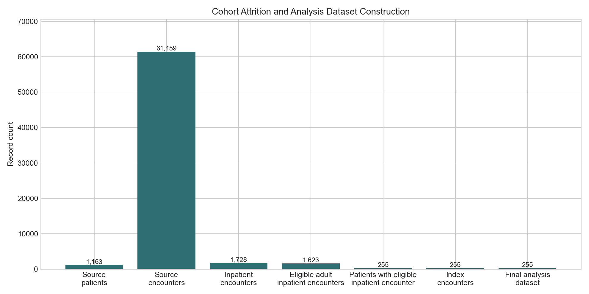
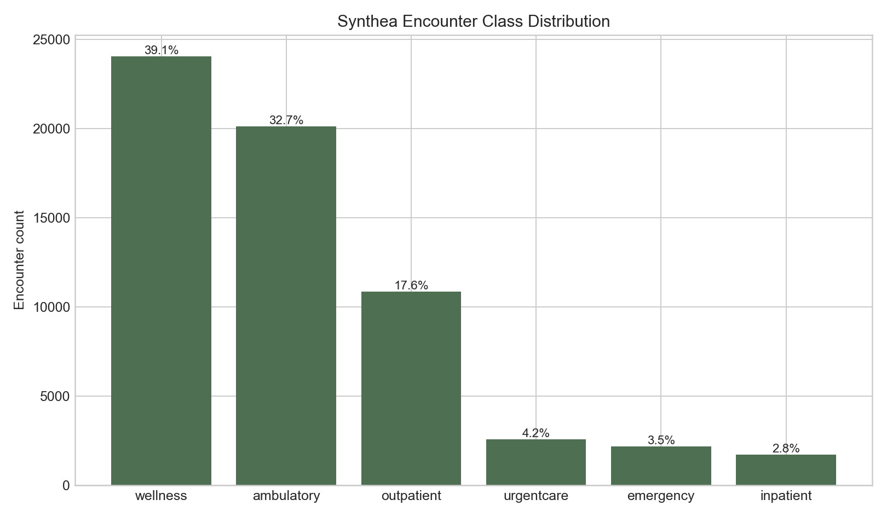
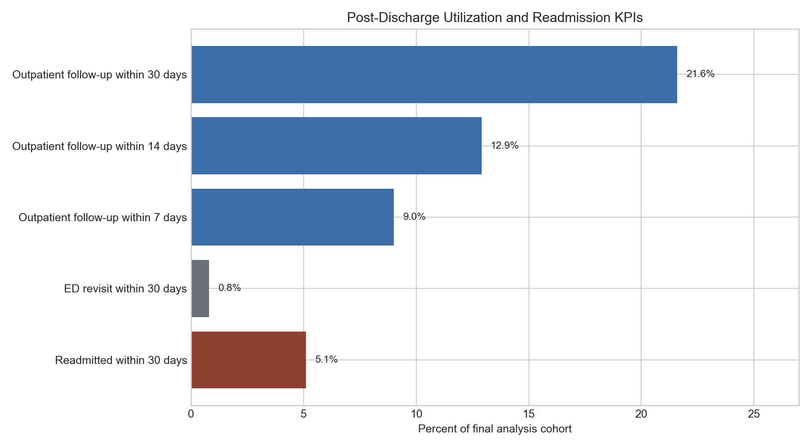
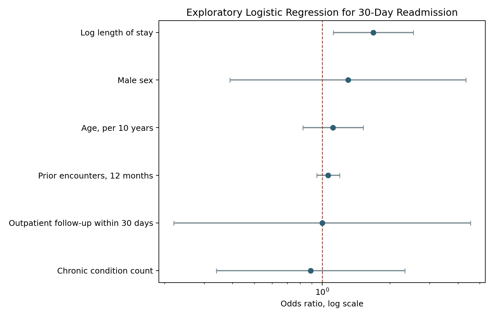

# Retrospective EHR Post-Discharge Utilization Analytics Report

## Executive Summary

This report summarizes the current SQL, validation, and BI/dashboard layer of the `ehr-readmission-analytics` portfolio project. The project uses Synthea synthetic EHR data to demonstrate a retrospective healthcare analytics workflow focused on inpatient cohort definition, post-discharge utilization tracking, outpatient follow-up timing, ED revisits, and all-cause 30-day inpatient readmission.

The current milestone includes data profiling, SQL cohort construction, validation QA outputs, aggregate dashboard-ready tables, descriptive analysis outputs, and an exploratory logistic regression model. It does not include causal inference.

## Research Question

Among adult patients with a first eligible acute inpatient hospitalization in Synthea synthetic EHR data, how are outpatient follow-up timing, demographic characteristics, clinical conditions, prior utilization, and discharge-related factors associated with all-cause inpatient readmission within 30 days of discharge?

## Data Source

The project uses Synthea synthetic EHR CSV files stored locally in `data/raw/`. Raw CSVs and processed database files are not committed to GitHub. The committed outputs are small aggregate validation and BI tables intended for portfolio review.

No real patient data are included in this repository.

## Methods Summary

The SQL workflow uses DuckDB-compatible scripts to:

1. Profile source tables and encounter classes.
2. Define eligible adult inpatient encounters.
3. Select the first eligible inpatient encounter as the index encounter.
4. Derive post-discharge utilization measures.
5. Derive all-cause 30-day inpatient readmission.
6. Create the final analysis dataset.
7. Export aggregate validation QA tables.
8. Export Power BI/Tableau-ready aggregate tables.
9. Generate descriptive analysis outputs and exploratory logistic regression results in notebooks.

The current workflow intentionally separates data profiling, cohort construction, validation, and dashboard output generation so each layer can be reviewed independently.

## Cohort Construction

The final analysis dataset includes one index encounter per adult patient with a first eligible inpatient encounter.

| Cohort step | Count |
| --- | ---: |
| Source patients | 1,163 |
| Source encounters | 61,459 |
| Source inpatient encounters | 1,728 |
| Eligible adult inpatient encounters | 1,623 |
| Patients with eligible adult inpatient encounter | 255 |
| Index encounters | 255 |
| Final analysis dataset rows | 255 |

## Encounter Classification

The source `encounters.csv` file contains distinguishable encounter classes needed for the current MVP definitions.

| Encounter class | Count | Percent |
| --- | ---: | ---: |
| wellness | 24,038 | 39.11 |
| ambulatory | 20,124 | 32.74 |
| outpatient | 10,837 | 17.63 |
| urgentcare | 2,564 | 4.17 |
| emergency | 2,168 | 3.53 |
| inpatient | 1,728 | 2.81 |

## Validation Findings

Validation checks support the current SQL cohort logic:

- One index encounter per patient: 255 index rows and 255 distinct patients.
- Duplicate patient index rows: 0.
- Missing patient IDs in final dataset: 0.
- Missing index encounter IDs in final dataset: 0.
- Under-18 index rows: 0.
- Negative length-of-stay rows: 0.
- Discharge-before-admission rows: 0.
- Missing or invalid encounter start/stop dates in final dataset: 0.

Missingness is expected for timing variables that only apply to patients with observed readmission or outpatient follow-up. For example, `days_to_readmission` is missing for patients without a 30-day readmission, and `days_to_first_outpatient_followup` is missing for patients without observed outpatient follow-up.

## Aggregate Results Snapshot

| Measure | Value |
| --- | ---: |
| Final analysis cohort | 255 patients |
| 30-day inpatient readmission | 13 patients |
| 30-day inpatient readmission rate | 5.1% |
| Mean days to readmission | 20.98 |
| Outpatient follow-up within 7 days | 23 patients, 9.0% |
| Outpatient follow-up within 14 days | 33 patients, 12.9% |
| Outpatient follow-up within 30 days | 55 patients, 21.6% |
| ED revisit within 30 days | 2 patients, 0.8% |
| Any post-discharge encounter within 30 days | 96 patients, 37.6% |

## Dashboard Layer

The project includes dashboard-ready aggregate CSV files in `outputs/bi/`:

- `cohort_summary_table.csv`
- `readmission_kpi_table.csv`
- `followup_timing_table.csv`
- `ed_revisit_table.csv`
- `demographic_utilization_summary_table.csv`

These tables are designed for Power BI or Tableau import and support stakeholder-facing reporting around readmission KPIs, outpatient follow-up timing, ED revisits, cohort demographics, and utilization summaries.

## Descriptive Analysis Outputs

The notebook workflow generates aggregate analysis outputs in `outputs/analysis/`:

- `table1_baseline_characteristics.csv`
- `readmission_summary.csv`
- `outpatient_followup_summary.csv`
- `ed_revisit_summary.csv`

Table 1 compares baseline characteristics by 30-day readmission status using aggregate summaries only. Continuous variables are summarized as mean and standard deviation; categorical variables are summarized as count and percent.

## Exploratory Logistic Regression

An exploratory logistic regression model was fit for 30-day inpatient readmission using a parsimonious predictor set:

- Age, per 10 years
- Male sex
- Log length of stay
- Prior encounters in the 12 months before index admission
- Chronic condition count
- Outpatient follow-up within 30 days

The model included 255 observations and 13 readmission events. The model converged, with pseudo R-squared of 0.0665. Model coefficients and odds ratios are available in `outputs/analysis/logistic_regression_results.csv`.

| Predictor | Odds ratio | 95% CI | p-value |
| --- | ---: | --- | ---: |
| Age, per 10 years | 1.1158 | 0.8201-1.5180 | 0.4855 |
| Male sex | 1.2994 | 0.3896-4.3341 | 0.6700 |
| Log length of stay | 1.6847 | 1.1189-2.5365 | 0.0125 |
| Prior encounters, 12 months | 1.0621 | 0.9457-1.1929 | 0.3092 |
| Chronic condition count | 0.8868 | 0.3387-2.3218 | 0.8067 |
| Outpatient follow-up within 30 days | 0.9978 | 0.2193-4.5402 | 0.9977 |

These model results are synthetic-data demonstration outputs. They should not be interpreted as clinically valid estimates.

## Interpretation

These results should be interpreted as synthetic-data workflow outputs. They demonstrate cohort construction, validation, temporal logic, and aggregate reporting, but they do not establish clinical validity or causal relationships.

Outpatient follow-up measures are descriptive utilization measures. The current project does not claim that outpatient follow-up reduces or increases readmission risk.

## Limitations

- Synthea records are synthetic and are not real patient records.
- The encounter and condition distributions may not reflect a real health system population.
- The current report is based on aggregate outputs and does not include patient-level review.
- Condition flags use simplified grouping logic suitable for synthetic EHR data.
- Planned versus unplanned readmission distinctions are not implemented in the current MVP.
- The logistic regression model is exploratory and limited by the small number of synthetic readmission events.
- The project is not intended for clinical decision-making, quality reporting, or operational deployment.

## Reproducibility

To reproduce the current outputs:

1. Place Synthea CSV files in `data/raw/`.
2. Run SQL scripts `01` through `08` in `sql/` using DuckDB.
3. Review aggregate QA outputs in `outputs/validation/`.
4. Review BI-ready aggregate outputs in `outputs/bi/`.
5. Run `notebooks/02_descriptive_analysis.ipynb` and `notebooks/03_logistic_regression.ipynb`.
6. Review analysis outputs in `outputs/analysis/`.
7. Review report figures in `outputs/figures/`.
