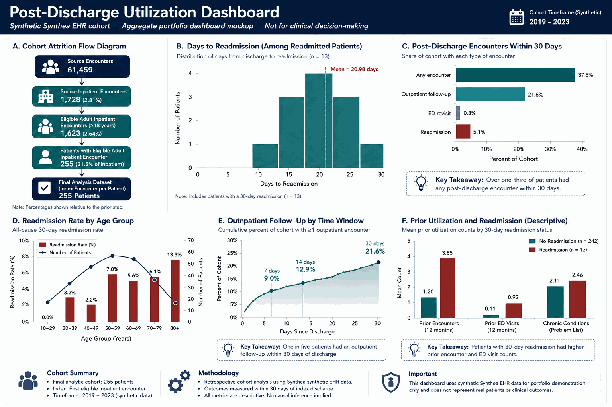
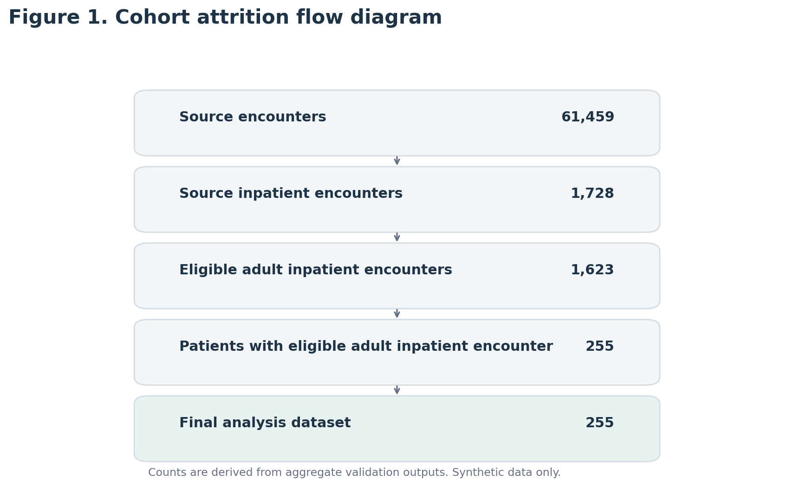
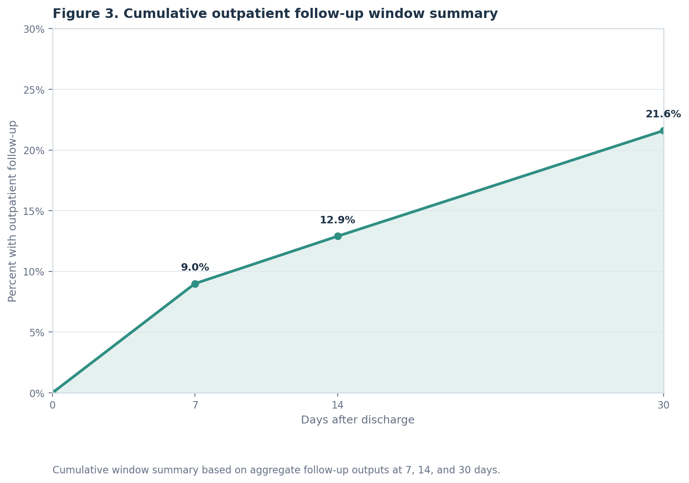
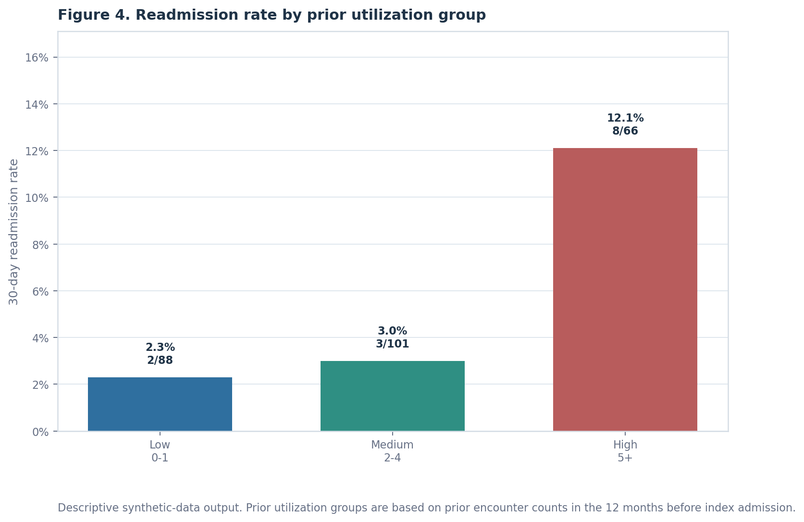
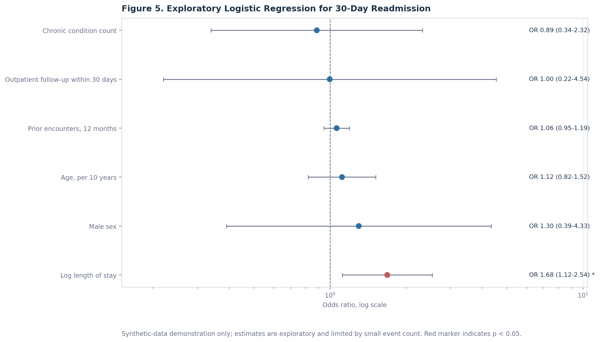

# Retrospective EHR Post-Discharge Utilization Analytics Report

## Abstract

This project demonstrates a retrospective healthcare analytics workflow using Synthea synthetic EHR data. The analysis defines an adult inpatient cohort, selects the first eligible inpatient encounter as the index hospitalization, derives post-discharge outpatient follow-up timing and ED revisit measures, identifies all-cause 30-day inpatient readmission, validates cohort and temporal logic, and produces aggregate reporting outputs for healthcare operations and research analytics audiences. The final synthetic cohort included 255 adult patients with a first eligible inpatient encounter. The 30-day inpatient readmission rate was 5.1%, outpatient follow-up within 30 days was 21.6%, and ED revisit within 30 days was 0.8%. An exploratory logistic regression model was fit for demonstration only and should not be interpreted as clinical evidence. The project is intended as a portfolio workflow and does not use real patient data.

## Executive Summary

This report summarizes the current SQL, validation, and BI/dashboard layer of the `ehr-readmission-analytics` portfolio project. The project uses Synthea synthetic EHR data to demonstrate a retrospective healthcare analytics workflow focused on inpatient cohort definition, post-discharge utilization tracking, outpatient follow-up timing, ED revisits, and all-cause 30-day inpatient readmission.

The current milestone includes data profiling, SQL cohort construction, validation QA outputs, aggregate dashboard-ready tables, descriptive analysis outputs, and an exploratory logistic regression model. It does not include causal inference.

The main analytic signal in the current synthetic cohort is prior utilization. Patients with 30-day readmission had higher prior encounter and prior ED visit counts in Table 1. The exploratory model is included to demonstrate adjusted association reporting, but the event count is too small to support clinical prediction.

## Research Question

Among adult patients with a first eligible acute inpatient hospitalization in Synthea synthetic EHR data, how are outpatient follow-up timing, demographic characteristics, clinical conditions, prior utilization, and discharge-related factors associated with all-cause inpatient readmission within 30 days of discharge?

## Data Source

The project uses Synthea synthetic EHR CSV files stored locally in `data/raw/`. Raw CSVs and processed database files are not committed to GitHub. The committed outputs are small aggregate validation and BI tables intended for portfolio review.

No real patient data are included in this repository.

## Methods Summary

The SQL workflow uses DuckDB-compatible scripts to:

1. Profile source tables and encounter classes.
2. Define eligible adult inpatient encounters.
3. Select the first eligible inpatient encounter as the index encounter.
4. Derive post-discharge utilization measures.
5. Derive all-cause 30-day inpatient readmission.
6. Create the final analysis dataset.
7. Export aggregate validation QA tables.
8. Export Power BI/Tableau-ready aggregate tables.
9. Generate descriptive analysis outputs and exploratory logistic regression results in notebooks.

The current workflow intentionally separates data profiling, cohort construction, validation, and dashboard output generation so each layer can be reviewed independently.

## Post-Discharge Utilization Analytics Summary

Synthetic Synthea EHR cohort | Aggregate portfolio dashboard mockup | Not for clinical decision-making

Figure 1. Post-Discharge Utilization Analytics Summary. Multi-panel summary of the synthetic Synthea post-discharge utilization workflow. Panel A shows cohort attrition from source encounters to the final analytic cohort. Panel B shows days to readmission among patients with a 30-day readmission. Panel C summarizes post-discharge encounter types within 30 days. Panel D compares readmission rates across age groups. Panel E shows cumulative outpatient follow-up within 7, 14, and 30 days. Panel F compares prior utilization and chronic condition burden by readmission status. This figure uses synthetic data only and is intended for portfolio demonstration, not clinical decision-making.

## How to Read Figure 1

- Panel A: Documents the cohort construction pathway and confirms that the final analysis dataset includes 255 adult patients with one index inpatient encounter per patient.
- Panel B: Shows timing among the 13 patients with 30-day inpatient readmission, with mean days to readmission of 20.98 days.
- Panel C: Summarizes 30-day post-discharge utilization: any encounter, outpatient follow-up, ED revisit, and readmission.
- Panel D: Displays descriptive readmission rate variation by age group. Interpret cautiously because several age groups have small cell counts.
- Panel E: Shows outpatient follow-up accumulation over time, with 9.0% by 7 days, 12.9% by 14 days, and 21.6% by 30 days.
- Panel F: Highlights the main descriptive signal in the synthetic cohort: patients with readmission had higher prior encounter and prior ED visit counts.

## Cohort Construction

The final analysis dataset includes one index encounter per adult patient with a first eligible inpatient encounter.

Panel A of Figure 1 summarizes the cohort attrition process, beginning with 61,459 source encounters and ending with 255 adult patients in the final analytic dataset.

| Cohort step | Count |
| --- | ---: |
| Source patients | 1,163 |
| Source encounters | 61,459 |
| Source inpatient encounters | 1,728 |
| Eligible adult inpatient encounters | 1,623 |
| Patients with eligible adult inpatient encounter | 255 |
| Index encounters | 255 |
| Final analysis dataset rows | 255 |

## Encounter Classification

The source `encounters.csv` file contains distinguishable encounter classes needed for the current MVP definitions.

| Encounter class | Count | Percent |
| --- | ---: | ---: |
| wellness | 24,038 | 39.11 |
| ambulatory | 20,124 | 32.74 |
| outpatient | 10,837 | 17.63 |
| urgentcare | 2,564 | 4.17 |
| emergency | 2,168 | 3.53 |
| inpatient | 1,728 | 2.81 |

## Validation Findings

Validation checks support the current SQL cohort logic:

- One index encounter per patient: 255 index rows and 255 distinct patients.
- Duplicate patient index rows: 0.
- Missing patient IDs in final dataset: 0.
- Missing index encounter IDs in final dataset: 0.
- Under-18 index rows: 0.
- Negative length-of-stay rows: 0.
- Discharge-before-admission rows: 0.
- Missing or invalid encounter start/stop dates in final dataset: 0.

Missingness is expected for timing variables that only apply to patients with observed readmission or outpatient follow-up. For example, `days_to_readmission` is missing for patients without a 30-day readmission, and `days_to_first_outpatient_followup` is missing for patients without observed outpatient follow-up.

## Dashboard Layer

The project includes dashboard-ready aggregate CSV files in `outputs/bi/`:

- `cohort_summary_table.csv`
- `readmission_kpi_table.csv`
- `followup_timing_table.csv`
- `ed_revisit_table.csv`
- `demographic_utilization_summary_table.csv`

These tables are designed for Power BI or Tableau import and support stakeholder-facing reporting around readmission KPIs, outpatient follow-up timing, ED revisits, cohort demographics, and utilization summaries.

The project also includes a multi-panel healthcare analytics summary visual that illustrates how aggregate outputs could be arranged for a healthcare operations or population health audience.

Panel C and Panel E of Figure 1 summarize the post-discharge utilization measures used for dashboard reporting, including any 30-day encounter, outpatient follow-up, ED revisit, and readmission.

## Aggregate Results Snapshot

| Measure | Value |
| --- | ---: |
| Final analysis cohort | 255 patients |
| 30-day inpatient readmission | 13 patients |
| 30-day inpatient readmission rate | 5.1% |
| Mean days to readmission | 20.98 |
| Outpatient follow-up within 7 days | 23 patients, 9.0% |
| Outpatient follow-up within 14 days | 33 patients, 12.9% |
| Outpatient follow-up within 30 days | 55 patients, 21.6% |
| ED revisit within 30 days | 2 patients, 0.8% |
| Any post-discharge encounter within 30 days | 96 patients, 37.6% |

Panel B of Figure 1 shows the distribution of days to readmission among the 13 readmitted patients, supporting the report's timing-focused interpretation of post-discharge utilization. Panel E shows that outpatient follow-up accumulates gradually across the 30-day window.

## Descriptive Analysis Outputs

The notebook workflow generates aggregate analysis outputs in `outputs/analysis/`:

- `table1_baseline_characteristics.csv`
- `readmission_summary.csv`
- `outpatient_followup_summary.csv`
- `ed_revisit_summary.csv`
- `risk_stratification_summary.csv`

Table 1 compares baseline characteristics by 30-day readmission status using aggregate summaries only. Continuous variables are summarized as mean and standard deviation; categorical variables are summarized as count and percent.

## Analytic Findings

The analysis layer is intended to go beyond dashboard KPI summaries by describing baseline differences, subgroup patterns, and adjusted associations.

In the current synthetic cohort, prior utilization is the clearest descriptive signal:

- Prior encounters in the 12 months before index admission were higher among readmitted patients: 4.92 versus 3.66 encounters, p = 0.0405.
- Prior ED visits in the 12 months before index admission were higher among readmitted patients: 0.69 versus 0.24 visits, p = 0.0005.
- Outpatient follow-up within 30 days was similar between groups: 23.1% among readmitted patients versus 21.5% among non-readmitted patients.
- ED revisit within 30 days was rare overall and should not be overinterpreted.

Risk stratification outputs are available in `outputs/analysis/risk_stratification_summary.csv`. These outputs summarize readmission and utilization patterns by selected age, chronic condition burden, and sex groups. Several strata have small event counts, so the purpose is to identify stakeholder questions rather than make stable clinical risk claims.

Panel D of Figure 1 provides a descriptive age-group comparison. These rates should be interpreted as exploratory because of the small number of readmission events.

In a real health system setting, these findings would support discussion of whether prior ED use or broader prior utilization should be used for transition-of-care review, outreach prioritization, or more detailed subgroup analysis.

Panel F of Figure 1 visually summarizes the strongest descriptive signal in the current synthetic cohort: patients with 30-day readmission had higher mean prior encounter and prior ED visit counts than patients without readmission.

## Statistical Caution for Tableau Subgroup Outputs

The Tableau dashboard export package includes additional uncertainty fields for age-group and condition-group readmission summaries. These fields are intended to make subgroup charts more transparent, not to convert the synthetic-data analysis into a clinically validated inference.

For age group, 30-day readmission was 5.8% among patients under 65, with a Wilson 95% confidence interval of 3.3% to 9.8%, and 2.1% among patients age 65 or older, with a Wilson 95% confidence interval of 0.4% to 11.1%. Fisher's exact test was used for the age-group comparison because at least one expected cell count was less than 5; the exploratory comparison p-value was 0.4726.

For condition groups, readmission rates were exported with Wilson 95% confidence intervals and subgroup sample-size notes:

| Condition group | Patients | Readmitted | Readmission rate | Wilson 95% CI | Sample-size note |
| --- | ---: | ---: | ---: | --- | --- |
| COPD | 4 | 0 | 0.0% | 0.0%-49.0% | Small subgroup; rate should be interpreted cautiously. |
| Chronic kidney disease | 8 | 1 | 12.5% | 2.2%-47.1% | Small subgroup; rate should be interpreted cautiously. |
| Diabetes | 21 | 2 | 9.5% | 2.7%-28.9% | Small subgroup; rate should be interpreted cautiously. |
| Hypertension | 74 | 4 | 5.4% | 2.1%-13.1% | Subgroup size >= 30; still descriptive and exploratory. |

These subgroup results are based on synthetic Synthea data and simplified condition flags. They should be interpreted as exploratory dashboard context only. They are not causal findings, not clinically representative estimates, and not a validated risk stratification model.

## Exploratory Logistic Regression

An exploratory logistic regression model was fit for 30-day inpatient readmission using a parsimonious predictor set:

- Age, per 10 years
- Male sex
- Log length of stay
- Prior encounters in the 12 months before index admission
- Chronic condition count
- Outpatient follow-up within 30 days

The model included 255 observations and 13 readmission events. The model converged, with pseudo R-squared of 0.0665. Model coefficients and odds ratios are available in `outputs/analysis/logistic_regression_results.csv`.

| Predictor | Odds ratio | 95% CI | p-value |
| --- | ---: | --- | ---: |
| Age, per 10 years | 1.1158 | 0.8201-1.5180 | 0.4855 |
| Male sex | 1.2994 | 0.3896-4.3341 | 0.6700 |
| Log length of stay | 1.6847 | 1.1189-2.5365 | 0.0125 |
| Prior encounters, 12 months | 1.0621 | 0.9457-1.1929 | 0.3092 |
| Chronic condition count | 0.8868 | 0.3387-2.3218 | 0.8067 |
| Outpatient follow-up within 30 days | 0.9978 | 0.2193-4.5402 | 0.9977 |

These model results are synthetic-data demonstration outputs. They should not be interpreted as clinically valid estimates.

Logistic regression is appropriate for the primary adjusted association analysis because the outcome is binary and odds ratios are standard in clinical research and healthcare analytics reporting. However, it is not sufficient by itself to tell the analytic story. The current model has only 13 readmission events, so estimates may be unstable and confidence intervals should be interpreted cautiously.

In a real analysis with a larger governed dataset, next modeling steps could include penalized logistic regression, Firth-style rare-events logistic regression, or a prespecified parsimonious adjusted model with validation. Machine learning models would only be appropriate if the objective changed to validated prediction and sufficient data were available for training, testing, calibration, and performance reporting.

## Sensitivity Analysis Priorities

The next analysis pass should focus on sensitivity analyses before adding more complex models:

- Compare 7-day, 14-day, and 30-day outpatient follow-up windows.
- Fit adjusted models with and without outpatient follow-up variables because of timing bias concerns.
- Stratify summaries by prior ED use, prior encounter burden, chronic condition count, age group, and length-of-stay category.
- Review same-day returns and possible transfer-like encounters separately.
- Consider disease-specific cohorts only if diagnosis grouping logic is defensible from condition records.

## Translation to a Real Health System Setting

In a real hospital or health system analytics environment, this workflow would map to a common post-discharge utilization request from a physician investigator, quality improvement leader, or population health team. The same structure could be adapted to deidentified EHR warehouse tables by replacing Synthea source files with governed encounter, patient, diagnosis, payer, and utilization extracts.

Operationally, the workflow would support:

- confirming whether inpatient, outpatient, ambulatory, emergency, and observation encounters are reliably distinguishable
- agreeing on cohort inclusion and exclusion criteria with clinical stakeholders
- validating index admission, discharge timing, follow-up windows, and readmission logic
- documenting how transfers, same-day returns, ED-only revisits, and incomplete follow-up windows are handled
- producing aggregate QA outputs for analyst and stakeholder review before modeling
- creating BI-ready tables for readmission KPIs, post-discharge follow-up monitoring, ED revisit reporting, and cohort summaries
- communicating limitations, data quality concerns, and non-causal interpretation clearly

Additional real-world steps would include IRB or quality-improvement determination, data access approvals, privacy review, code review, clinical validation of definitions, and comparison against known operational reporting logic.

## Interpretation

These results should be interpreted as synthetic-data workflow outputs. They demonstrate cohort construction, validation, temporal logic, and aggregate reporting, but they do not establish clinical validity or causal relationships.

Outpatient follow-up measures are descriptive utilization measures. The current project does not claim that outpatient follow-up reduces or increases readmission risk.

## Limitations

- Synthea records are synthetic and are not real patient records.
- The encounter and condition distributions may not reflect a real health system population.
- The current report is based on aggregate outputs and does not include patient-level review.
- Condition flags use simplified grouping logic suitable for synthetic EHR data.
- Planned versus unplanned readmission distinctions are not implemented in the current MVP.
- The logistic regression model is exploratory and limited by the small number of synthetic readmission events.
- The project is not intended for clinical decision-making, quality reporting, or operational deployment.

## Reproducibility

To reproduce the current outputs:

1. Place Synthea CSV files in `data/raw/`.
2. Run SQL scripts `01` through `08` in `sql/` using DuckDB.
3. Review aggregate QA outputs in `outputs/validation/`.
4. Review BI-ready aggregate outputs in `outputs/bi/`.
5. Run `notebooks/02_descriptive_analysis.ipynb` and `notebooks/03_logistic_regression.ipynb`.
6. Review analysis outputs in `outputs/analysis/`.
7. Regenerate professional report figures with `python scripts/generate_professional_figures.py`.
8. Review report figures in `outputs/figures/`.
