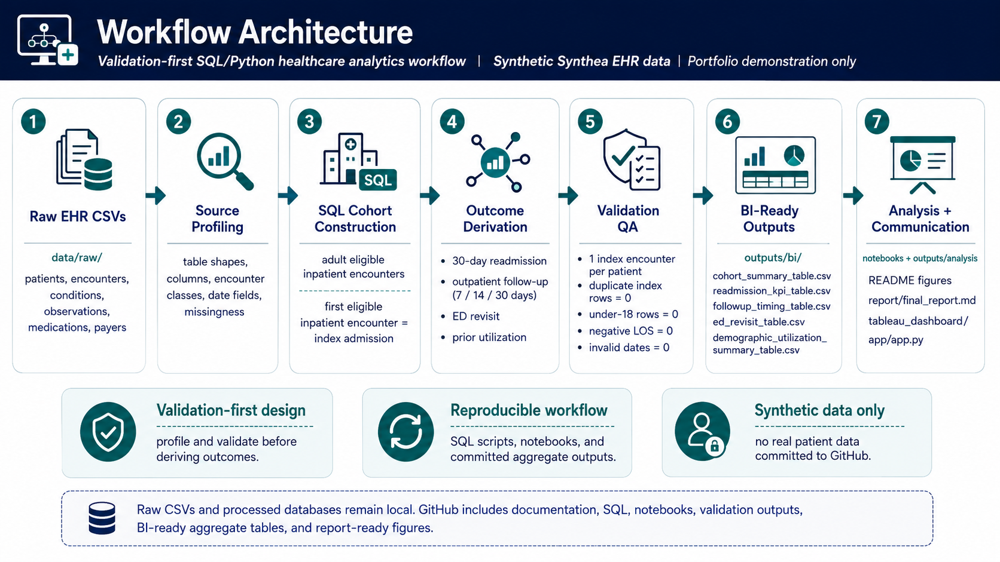
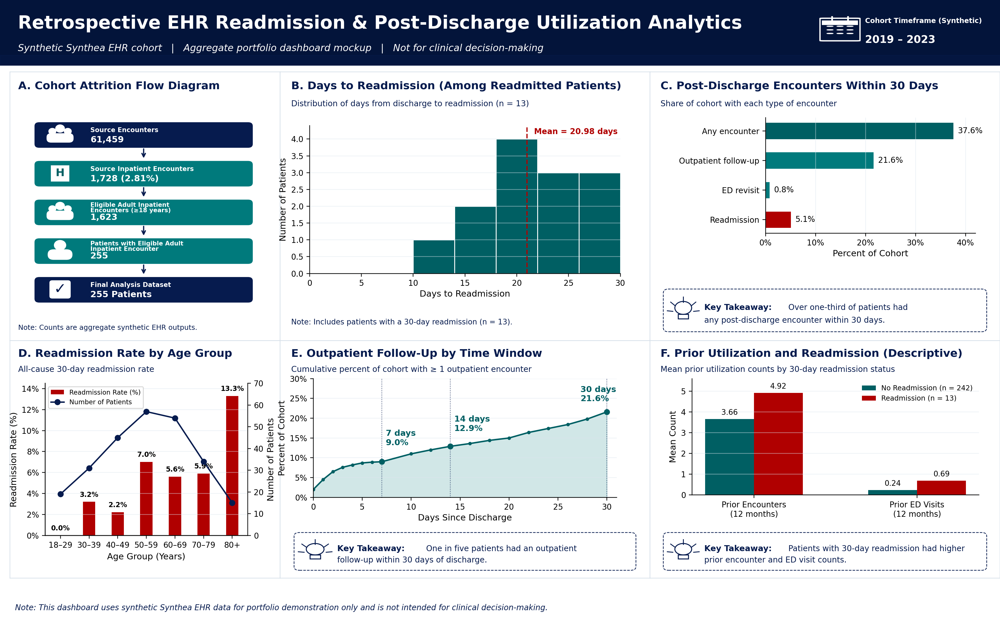
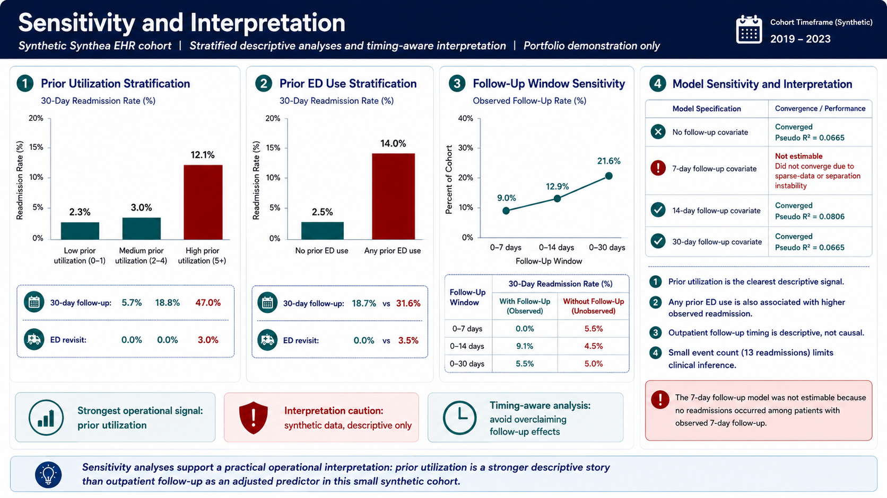

# EHR Post-Discharge Utilization Analytics: Version 1 Descriptive Cohort Validation Report

## Abstract

This Version 1 report validates a descriptive healthcare analytics workflow using Synthea synthetic EHR data. The workflow defines an adult inpatient index cohort, applies one-row-per-patient index hospitalization logic, derives temporal post-discharge utilization outcomes, and produces transparent aggregate reporting outputs for review. The final synthetic cohort included 255 adult patients. The 30-day inpatient readmission rate was 5.1%, outpatient follow-up within 30 days was 21.6%, ED revisit within 30 days was 0.8%, and any post-discharge encounter within 30 days was 37.6%. Prior utilization burden and prior ED use showed the clearest descriptive patterns in this synthetic cohort. These results are intended as workflow validation and descriptive reporting, not clinical evidence or a clinical prediction model.

## Executive Summary

Version 1 establishes a validation foundation for a retrospective post-discharge utilization analytics workflow. The analysis confirms that SQL and Python can reliably construct an adult inpatient index cohort from synthetic EHR files, derive 30-day post-discharge utilization outcomes, validate temporal logic, and produce aggregate outputs suitable for descriptive healthcare analytics review.

The final analytic dataset contains 255 adult patients with one index inpatient encounter per patient. The validation checks support the current cohort logic: no duplicate patient index rows, no missing patient or index encounter IDs, no under-18 index rows, no negative length-of-stay rows, no discharge-before-admission rows, and no missing or invalid encounter start or stop dates in the final dataset.

The descriptive outcome profile is intentionally modest. Thirteen patients had a 30-day inpatient readmission, 55 patients had outpatient follow-up within 30 days, 2 patients had an ED revisit within 30 days, and 96 patients had any post-discharge encounter within 30 days. Prior utilization burden and prior ED use are useful operational stratification variables in this synthetic cohort, but they are not clinically validated evidence. Sparse synthetic readmission events make predictive modeling unstable, so modeling results are archived outside the main V1 report.

## Version 1 Scope

Version 1 focuses on descriptive cohort and outcome validation. It validates:

- Cohort construction from synthetic EHR source files.
- Encounter classification needed for inpatient cohort selection and post-discharge utilization measurement.
- Index hospitalization logic using the first eligible adult inpatient encounter.
- One-row-per-patient final analysis structure.
- Temporal outcome logic for 30-day inpatient readmission, outpatient follow-up, ED revisit, and any post-discharge encounter.
- Descriptive utilization reporting and stratified summaries.
- Data limitations that should be understood before any future predictive modeling work.

Validation question:

Can a SQL and Python workflow using synthetic EHR data reliably define an adult inpatient index cohort, derive 30-day post-discharge utilization outcomes, and produce transparent descriptive reporting outputs for healthcare analytics use cases?

## Data Source and Cohort Construction

The project uses Synthea synthetic EHR CSV files stored locally in `data/raw/`. The report uses aggregate validation tables, analysis outputs, and static report figures generated from the synthetic workflow. No real patient data are included.

The SQL and Python workflow profiles source encounters, defines eligible adult inpatient encounters, selects the first eligible inpatient encounter as the index hospitalization, derives post-discharge utilization measures, identifies all-cause 30-day inpatient readmission, validates cohort and temporal logic, and generates report-ready aggregate outputs. Raw Synthea CSV files remain local; committed outputs are aggregate validation tables, aggregate analysis tables, and static figures.

The final analysis dataset includes one index encounter per adult patient with a first eligible inpatient encounter. Cohort construction began with 61,459 source encounters and ended with 255 adult patients in the final analytic dataset.

| Cohort step | Count |
| --- | ---: |
| Source patients | 1,163 |
| Source encounters | 61,459 |
| Source inpatient encounters | 1,728 |
| Eligible adult inpatient encounters | 1,623 |
| Patients with eligible adult inpatient encounter | 255 |
| Index encounters | 255 |
| Final analysis dataset rows | 255 |

The source `encounters.csv` file contains distinguishable encounter classes needed for the inpatient cohort and post-discharge utilization definitions.

| Encounter class | Count | Percent |
| --- | ---: | ---: |
| wellness | 24,038 | 39.11 |
| ambulatory | 20,124 | 32.74 |
| outpatient | 10,837 | 17.63 |
| urgentcare | 2,564 | 4.17 |
| emergency | 2,168 | 3.53 |
| inpatient | 1,728 | 2.81 |

## Outcome Definitions

The final analysis dataset uses temporal post-discharge definitions anchored to the index inpatient discharge date.

| Measure | Version 1 definition |
| --- | --- |
| Index hospitalization | First eligible adult inpatient encounter per patient. |
| 30-day inpatient readmission | All-cause inpatient encounter after index discharge and within 30 days. |
| Outpatient follow-up | First observed outpatient encounter after index discharge, summarized within 7, 14, and 30 days. |
| ED revisit | Emergency encounter after index discharge and within 30 days. |
| Any post-discharge encounter | Any observed post-discharge encounter within 30 days. |
| Prior utilization | Encounter counts and ED visit counts in the 12 months before index admission. |

Outpatient follow-up is an observed post-discharge utilization measure. It should not be interpreted as evidence that follow-up prevents readmission, and it should not be treated as a simple baseline variable available at discharge for predictive modeling.

## Descriptive Validation Results

Validation checks support the current SQL cohort logic:

- One index encounter per patient: 255 index rows and 255 distinct patients.
- Duplicate patient index rows: 0.
- Missing patient IDs in final dataset: 0.
- Missing index encounter IDs in final dataset: 0.
- Under-18 index rows: 0.
- Negative length-of-stay rows: 0.
- Discharge-before-admission rows: 0.
- Missing or invalid encounter start/stop dates in final dataset: 0.

Missingness is expected for timing variables that only apply to patients with observed readmission or outpatient follow-up. For example, `days_to_readmission` is missing for patients without a 30-day readmission, and `days_to_first_outpatient_followup` is missing for patients without observed outpatient follow-up.

| Measure | Value |
| --- | ---: |
| Final analysis cohort | 255 patients |
| 30-day inpatient readmission | 13 patients |
| 30-day inpatient readmission rate | 5.1% |
| Mean days to readmission | 20.98 |
| Outpatient follow-up within 7 days | 23 patients, 9.0% |
| Outpatient follow-up within 14 days | 33 patients, 12.9% |
| Outpatient follow-up within 30 days | 55 patients, 21.6% |
| ED revisit within 30 days | 2 patients, 0.8% |
| Any post-discharge encounter within 30 days | 96 patients, 37.6% |

Outpatient follow-up accumulates gradually across the 30-day window. These follow-up measures describe observed post-discharge utilization and should not be interpreted causally.

The project includes report-ready aggregate tables and static summary visuals that support stakeholder-facing interpretation of readmission, follow-up timing, ED revisits, and cohort characteristics. Dashboard-style visuals are included in the appendix as portfolio/reporting artifacts rather than central validation findings.

## Prior Utilization Stratification

Prior utilization was the clearest descriptive pattern in the synthetic cohort. Patients with a 30-day readmission had higher observed prior encounter counts and higher observed prior ED visit counts than patients without readmission. This should be interpreted as a synthetic cohort signal and an operational stratification variable, not as clinically validated evidence.

| Prior utilization group | Patients | Readmitted | Readmission rate | 30-day follow-up | ED revisit |
| --- | ---: | ---: | ---: | ---: | ---: |
| Low prior utilization, 0-1 encounters | 88 | 2 | 2.3% | 5.7% | 0.0% |
| Medium prior utilization, 2-4 encounters | 101 | 3 | 3.0% | 18.8% | 0.0% |
| High prior utilization, 5+ encounters | 66 | 8 | 12.1% | 47.0% | 3.0% |

Patients with higher prior encounter burden had higher observed readmission, follow-up, and ED revisit rates. In a real health system setting, this type of table could support discussion about whether prior utilization should be considered for transition-of-care review, care management discussion, or future cohort refinement.

| Prior ED use group | Patients | Readmitted | Readmission rate | 30-day follow-up | ED revisit |
| --- | ---: | ---: | ---: | ---: | ---: |
| No prior ED use | 198 | 5 | 2.5% | 18.7% | 0.0% |
| Any prior ED use | 57 | 8 | 14.0% | 31.6% | 3.5% |

Patients with any prior ED use had a higher observed readmission rate than patients without prior ED use. This is a descriptive utilization pattern from synthetic data and should not be interpreted as clinically validated evidence.

### Follow-Up Window Summary

| Follow-up window | Follow-up count | Follow-up percent | Readmission rate with follow-up | Readmission rate without follow-up |
| --- | ---: | ---: | ---: | ---: |
| 0-7 days | 23 | 9.0% | 0.0% | 5.6% |
| 0-14 days | 33 | 12.9% | 9.1% | 4.5% |
| 0-30 days | 55 | 21.6% | 5.5% | 5.0% |

Observed outpatient follow-up increased as the window widened. These results describe observed follow-up patterns only. The follow-up groups are not randomized, and timing may be affected by early readmission, illness severity, care access, and scheduling processes.

## Limitations

- Because the project uses Synthea synthetic EHR data, findings should be interpreted as workflow validation rather than real-world clinical evidence.
- The final analytic cohort is small, with 255 adult patients.
- Only 13 patients had 30-day inpatient readmission.
- Sparse events make readmission modeling unstable.
- Subgroup estimates should be interpreted cautiously because several strata have small counts.
- Outpatient follow-up occurs after discharge, so it should not be treated as a simple baseline variable in a discharge-time prediction model.
- The encounter and condition distributions may not reflect a real health system population.
- Condition flags use simplified grouping logic suitable for synthetic EHR data.
- Planned versus unplanned readmission distinctions are not implemented in Version 1.
- The project is not intended for clinical decision-making, quality reporting, or operational deployment.

## Conclusion

Version 1 establishes a descriptive validation foundation for the project. It demonstrates cohort construction, temporal outcome engineering, descriptive utilization reporting, and honest interpretation of sparse synthetic data. This foundation can support future predictive risk stratification work using a larger synthetic cohort and stricter discharge-time feature design.

## Appendix: Dashboard and Reporting Artifacts

The visuals in this appendix are useful portfolio and reporting artifacts. They summarize the workflow and stakeholder-facing outputs, but they are not central to the Version 1 validation findings.

